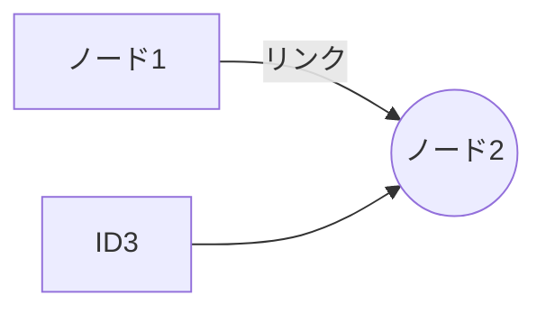

# 備忘録

時間ができた時に少しずつプログラミングやDTMをしています。

作業と作業の間が長期間空いてしまうことが多いので、備忘録としてまとめてみようと思います。

- raspberry pi
- ubuntu
- ren'py
- lmms

を少しずつ触っています。

情報処理技術者試験の勉強中です

現在の目標はネットワークスペシャリストを取得することです。

 

ブログを運営しています

[独楽鼠吾郎と3名の扶養家族](https://mgrsn.com)  

 
